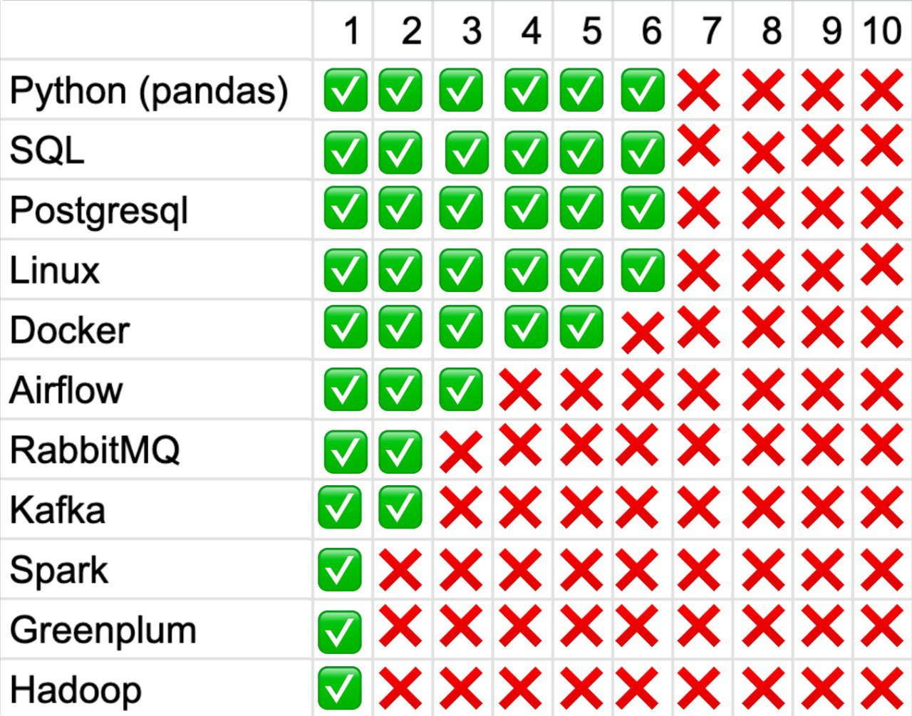
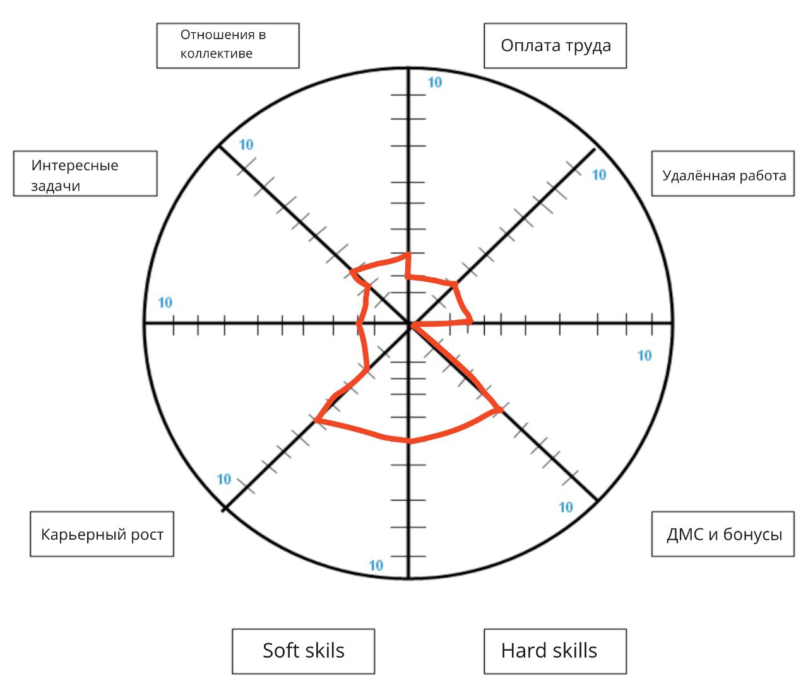
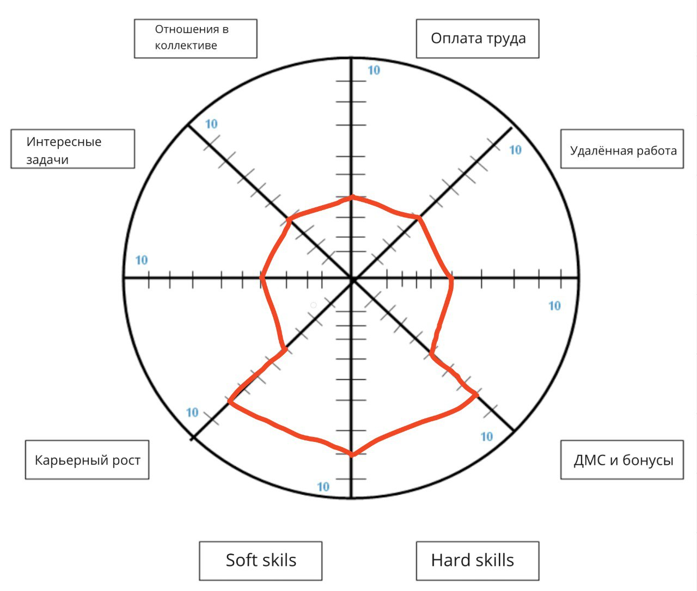

# Критерии выбора работы

- Оплата труда
- Удалённая работа
- ДМС и бонусы
- Hard skills
- Soft skills
- Карьерный рост
- Интересные задачи
- Отношения в коллективе

## Пояснения к критериям

#### Оплата труда:
- 10: 10'000'000 - 50'000'000 руб
- 9: 5'000'000 - 10'000'000 руб
- 8: 2'000'000 - 5'000'000 руб
- 7: 1'000'000 - 2'000'000 руб
- 6: 500'000 - 1'000'000 руб
- 5: 300'000 - 500'000 руб
- 4: 200'000 - 300'000 руб
- 3: 150'000 - 200'000 руб
- 2: 100'000 - 150'000 руб
- 1: 50'000 - 100'000 руб

#### Удалённая работа:
- 10: полностью удалённая работа
- 9: удалённая работа и командировки
- 8: удалённая работа и редкие ночные дежурства
- 7: удалённая работа и ночные дежурства
- 6: гибрид, 1 день в неделю офис
- 5: гибрид, 2 дня в неделю офис
- 4: гибрид, 3 дня в неделю офис
- 3: офис 4 дня в неделю
- 2: офис 5 дней в неделю
- 1: офис 6 дней в неделю

#### ДМС и бонусы:
- `Расширенный полис ДМС`: Всем сотрудникам оформляют расширенный полис ДМС со стоматологией и предлагают по сниженной цене купить аналогичную страховку для членов семьи
- `Удаленная работа`: Возможность работать удаленно, что обеспечивает гибкий график и комфортные условия труда
- `Бонусы за результаты`: Система премирования и бонусов за достижение поставленных целей и результативность работы
- `Обучение и развитие`: Предоставление возможностей для профессионального обучения, развития и участия в конференциях и тренингах
- `Корпоративные мероприятия`: Проведение корпоративных мероприятий, командообразующих мероприятий и внутренних тренингов
- `Гибкий график`: Возможность гибкого графика работы и управления своим временем
- `Материальная поддержка`: Финансовая поддержка в виде компенсации затрат на спорт, культуру, питание, аренду жилья и другие нужды
- `Корпоративная мобильная связь`: Предоставление корпоративной мобильной связи и компенсация расходов на связь
- `Медицинские программы`: Доступ к медицинским программам, включая профилактические осмотры и консультации специалистов
- `Страхование жизни и здоровья`: Предоставление страхования жизни и здоровья на случай несчастных случаев и болезней
- `Психолог`
- `Обучающие курсы`
- `Английский`

#### Развитие навыков:

#### Карьерный рост:
- 10 - Владелец компании
- 9 - Лидер трайба
- 8 - Владелец продукта
- 7 - Руководитель
- 6 - Архитектор
- 5 - Тимлид
- 4 - Сеньор
- 3 - Мидл
- 2 - Джуниур
- 1 - Стажер

#### Интересные задачи:
- 10 - задачи уровня владельца компании
- 9 - задачи уровня лидера трайба
- 8 - задачи уровня владелец продукта
- 7 - задачи уровня руководитель
- 6 - задачи уровня архитектор
- 5 - задачи уровня тимлид
- 4 - задачи уровня сеньор
- 3 - задачи уровня мидл
- 2 - задачи уровня джуниур
- 1 - задачи уровня стажер

#### Развитие в коллективе:
- 10 - наставничество
- 5 - самообразование
- 1 - нет развития

#### Soft skills
- `Эмпатия`: Понимание и чувствительность к чувствам и точке зрения других людей
- `Коммуникация`: Эффективная коммуникация - это способность читать и писать текст, говорить и слушать активно, что важно для понимания и передачи информации
- `Problem solving`: способность решать проблемы, особенно в контексте новых вызовов, связанных с использованием AI и больших языковых моделей
- `Командная работа`: В эпоху AI и регулирования, командная работа стала еще более важной, так как технологии и регулирование требуют междисциплинарного сотрудничества
- `Адаптация`: способность адаптироваться к изменениям и работать эффективно в условиях неопределенности
- `Критическое мышление`: анализ информации и определение ее значимости, особенно в контексте больших объемов данных
- `Практическая сторона`: получение практических навыков через практическое использование различных программирующих языков и технологий
- `Работа над проектами`: способность планировать, организовывать и завершать проекты, особенно в контексте разработки и внедрения AI-технологий
- `Организация работы`: способность планировать и организовывать работу, эффективно управлять своим временем и ресурсами
- `Саморазвитие`: постоянное развитие и поиск способов улучшения своих навыков и знаний

### Текущее состояние

### Через 2 года

# Шаги для достижения цели:

`Оплата труда`:
- Четко определить свои долгосрочные и короткосрочные цели в карьере и личном плане, чтобы знать, к чему стремиться
- Дополнительно обучаться и получить необходимые квалификации для улучшения своих навыков и знаний, что может увеличить заработную плату
- Участвовать в конференциях, тренингах и мероприятиях, связанных со сферой деятельности, чтобы установить себя как специалиста и эксперта
- Изучить техники эффективного общения и активно участвуйть в обсуждениях и встречах, чтобы улучшить свои отношения с коллегами и руководством
- Разработать планы и схемы для каждого дня, недели и месяца, чтобы эффективно использовать свое время и достичь своих целей
- Отмечайть свои достижения и успехи, чтобы увидеть, как продвигаюсь к своим целям и получить мотивацию для дальнейших усилий
- Определить основные приоритеты в своей жизни и работе, чтобы сосредоточиться на тех задачах, которые наиболее важны для достижения своих целей
- Знакомься с людьми, которые могут помочь в моей карьере, и поддерживать свои отношения с коллегами и руководством
- Регулярно оценивать свой прогресс и результаты работы, чтобы убедиться, что нахожусь на правильном пути к достижению своих целей
- Веритить в свои навыки, знания и возможности, и убедить себя, что заслуживаю высокую оплату своего труда

`Удалённая работа`:
- Визуализировать свою цель: Определить конкретные цели и сроки для достижения удаленной работы
- Определить необходимые навыки: Определить все необходимые навыки и знания, которые вам потребуются для выполнения задач удаленно
- Разработайть планы связи: Определить, как и с кем  буду взаимодействовать и общаться в процессе выполнения задач
- Пройти обучение и тренинги, чтобы улучшить свои навыки и знания, необходимые для удаленной работы
- Установить границы между работой и личным временем: Определить границы между своим рабочим и личным временем, чтобы поддерживать здоровье и сбалансированный образ жизни
- Разработайть систему управления своим временем: Разработайть планы и схемы для каждого дня, недели и месяца, чтобы эффективно использовать свое время при удаленной работе
- Создайть комфортную рабочую среду: Установить комфортную рабочую среду, включая необходимые инструменты и ресурсы для успешного выполнения задач
- Устанавить систему мотивации и отзыва: Разработайть систему мотивации и отзыва, чтобы оставаться мотивированными и продуктивными при удаленной работе

`ДМС и бонусы`:
- Исследование компаний: Провести исследование компаний, чтобы выяснить, какие из них предлагают расширенный полис ДМС и другие бонусы для сотрудников
- Определение приоритетов: Определить, какие бонусы и условия для меня наиболее важны, чтобы сфокусироваться на компаниях, которые их предлагают
- Установить критерии отбора: Определить критерии, которым должна соответствовать компания, чтобы мог принять решение о выборе работодателя
- Изучение предложений: Изучить предложения компаний, чтобы узнать, какие именно бонусы и условия предлагаются, и сравните их между собой
- Проведение собеседований: Поднять вопрос о бонусах и ДМС на собеседованиях, чтобы убедиться, что компания соответствует ожиданиям
- Консультирование сотрудников: Поговорить с сотрудниками компании, чтобы узнать, насколько реально их предложения по бонусам и ДМС
- Анализ финансовых показателей: Проанализировать финансовые показатели компании, чтобы убедиться, что она может позволить себе предлагаемые бонусы и ДМС
- Разработка плана карьерного роста: Разработать план карьерного роста в компании, чтобы убедиться, что она может предложить вам не только бонусы, но и возможности для развития
- Принятие решения: Принять решение на основе сравнения предложений и анализа, какая компания лучше всего соответствует вашим ожиданиям
- Подписание договора: Подписать договор с компанией, которая предложила наилучшие условия по ДМС и бонусам

`Hard skills`:
- Подготовка портфолио: Создайть портфолио проектов, в которых участвовал, и подчеркнуть интересные задачи, которые удалось решить.
- Участие в сообществе: Присоединиться к сообществу Data Engineers, где можно узнать о новых тенденциях и методиках в области.
- Саморазвитие: Постоянно развиваться и изучать новые технологии, методики и инструменты, чтобы быть готовым к интересным вызовам.
- изучать курсы, читать книги

`Soft skills`:
- общаться с психологом
- Изучитm свои возможности: Определитm свои сильные стороны и области, где можyj улучшить свои soft skills, чтобы использовать их для развития
- Принимать риски: Быть готовы принимать риски и испытывать новые вещи, чтобы развивать свои soft skills в различных ситуациях
- Строить отношения: Устанавливать и поддерживать здоровые отношения с коллегами и руководством, чтобы создать поддерживающую атмосферу для развития своих soft skills
- Участвовать в обучении и тренингах: Проходить обучение и тренинги, связанные с развитием soft skills, чтобы получить практический опыт и научиться новым навыкам
- Проверять свой прогресс: Регулярно оценивать свой прогресс в развитии ваших soft skills, чтобы убедиться, что нахожусь на правильном пути к достижению своих целей
- Практиковать регулярно: Регулярно практиковать свои soft skills в повседневной жизни и на рабочем месте, чтобы укрепить и улучшить их
- Быть увереным в себе: Верить в свои навыки и знания, и убедиться, что вы заслуживаю успех в своей карьере

`Карьерный рост`:
- Определите цель: Четко определить желаемую должность и роль владельца продукта, чтобы иметь ясное представление о цели
- Изучитить требования: Изучить необходимые навыки, знания и опыт для работы владельцем продукта и определите, чему вам нужно научиться
- Развивать навыки продуктового менеджмента: Проходить обучение, читайть специализированную литературу, изучать методики и инструменты продуктового менеджмента
- Получите опыт работы с продуктами: Стараться участвовать в проектах, связанных с управлением продуктами, даже на начальном уровне, чтобы получить практический опыт
- Строить отношения: Устанавливайть контакты с профессионалами в области продуктового менеджмента, участвуйть в мероприятиях и семинарах, чтобы узнать больше о сфере
- Работайть над лидерскими качествами: Развивайть навыки управления, принятия решений, аналитического мышления и коммуникации, которые важны для владельца продукта
- Участвовать в проектах: Стараться участвовать в проектах, связанных с управлением продуктами, даже на начальном уровне, чтобы получить практический опыт
- Обучение и сертификация: Проходить обучение и получайть сертификаты в области продуктового менеджмента, чтобы подтвердить свои знания и навыки
- Подготовить план карьерного роста: Разработайть план карьерного роста, включающий этапы, сроки, обучение, сертификацию и приобретение опыта
- Стремиться к самосовершенствованию: Постоянно развиваться, изучайть новые тенденции и методики в области продуктового менеджмента, чтобы быть востребованным специалистом

`Интересные задачи`:
- Подготовка портфолио: Создать портфолио проектов, в которых участвовал, и подчеркнуть интересные задачи, которые удалось решить.
- Развитие технических навыков: Сосредоточиться на развитии навыков, необходимых для выполнения интересных задач, таких как работа с большими данными, машинным обучением, облачными технологиями и т.д.
- Обучение и сертификация: Проходить обучение и получать сертификаты, чтобы углубить знания и подтвердить свою экспертизу.
- Участие в проектах: Стараться участвовать в проектах, которые предлагают интересные задачи, связанные с обработкой и анализом данных, разработкой архитектуры данных, созданием инновационных решений и прочим.
- Сетевое взаимодействие: Устанавливайте контакты с профессионалами в области Data Engineering, чтобы узнать о проектах и возможностях, которые могли бы предложить интересные задачи.

`Отношения в коллективе`:
- Узнавать как можно больше о компании, ее ценностях, культуре и правилах, чтобы лучше понимать, как вести себя в коллективе
-  Не говорить слишком много о себе, лучше задавать вопросы и проявляйте интерес к другим людям
- Быть вежливым и уважительным к другим людям, даже если не согласен с их мнением
- Быть открытым к общению и готовым поддержать других людей, если они нуждаются в помощи
- Поддерживать командный дух и работать вместе с другими людьми, чтобы достичь общих целей
- Быть эмпатичным и понимающим к чувствам и потребностям других людей
- Поддерживайть положительную атмосферу в коллективе и избегайть конфликтов и негативных эмоций
- Быть готов к компромиссам и поиску общих решений, если возникают разногласия
- Поддерживайть общение с другими людьми и участвовать в различных мероприятиях и проектах
- Развивайте личные отношения с другими людьми и узнавайте о них больше, чтобы лучше понимать их потребности и интересы
