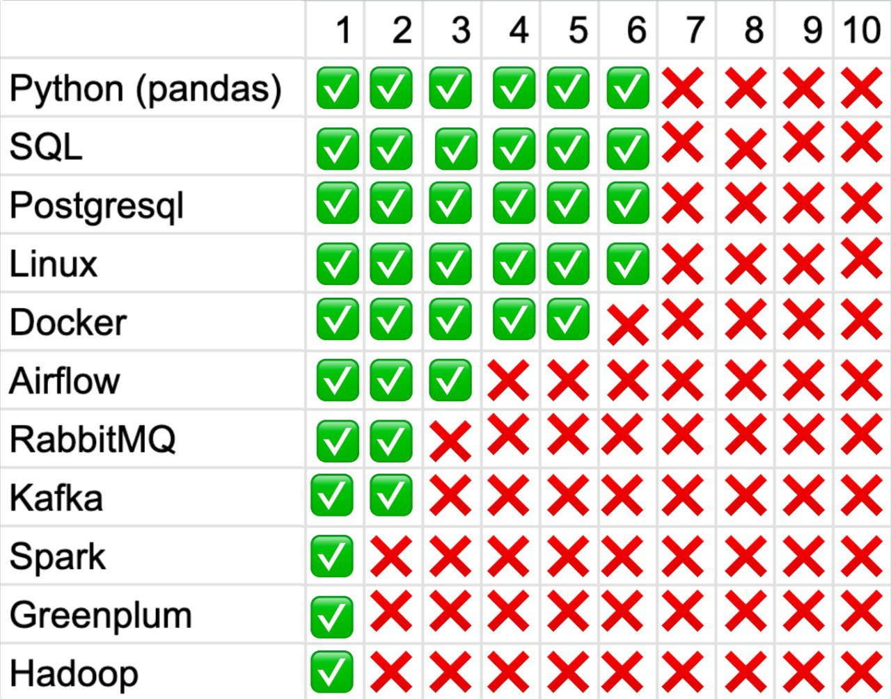
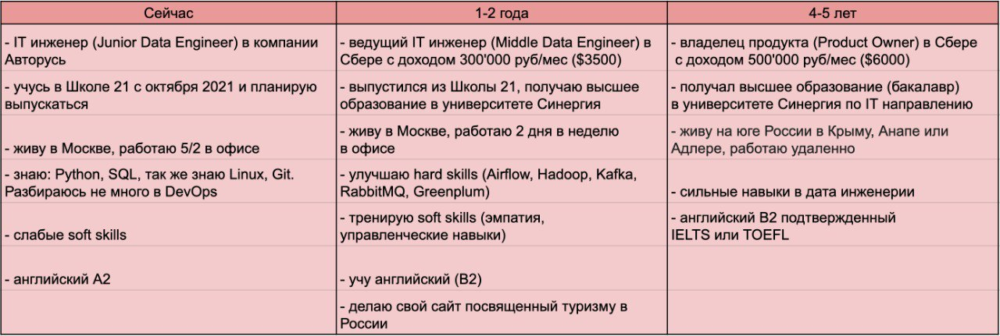

### Анализ вакансий

Семь вакансий на желаемую должность и требуемые знания:

### Выводы:

Наиболее важные скиллы - Spark, Hadoop, Airflow (уверенные знания требуются на всех вакансиях)

Наиболее полные знания я имею python и sql, Считаю необходимым подтягивать знания по Spark, Hadoop, Airflow. Способы:

- активное развитие на работе
- обучение по видеороликам и курсам

Таким образом формируем по методике SMART таблицу развития на ближайшее будущее:

### Шаги по достижению целей:

1. Пройти курс от Stepik по Airflow
2. Пройти курсы Data Engineer от [Карпов](https://karpov.courses/)
3. Читать книги по PostgreSQL, Airflow, Kafka, RabbitMQ

